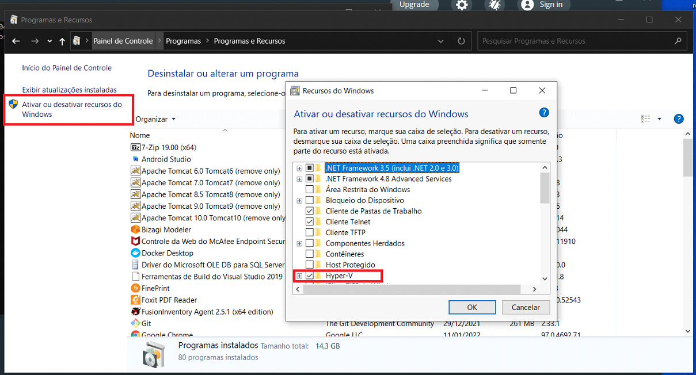
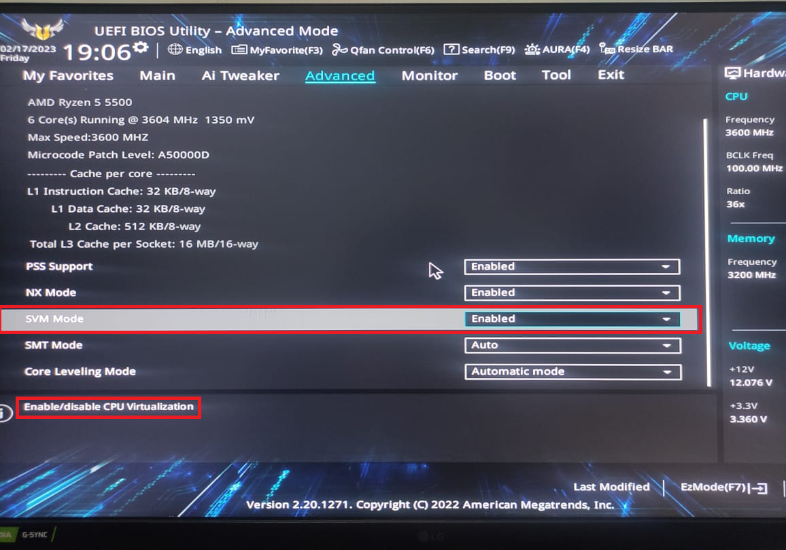
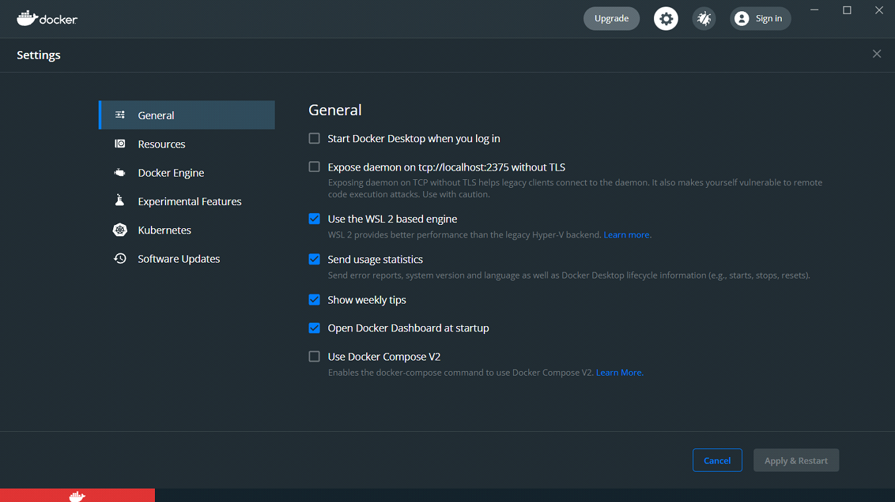

# Instalação do Docker no Windows

1. Digite os comandos abaixo em sequência
 
``` powershell
wsl --update 

dism.exe /online /enable-feature /featurename:Microsoft-Windows-Subsystem-Linux /all /norestart 

dism.exe /online /enable-feature /featurename:VirtualMachinePlatform /all /norestart 

wsl --set-default-version 2 
```

2. Habilite o Hyper-v e reincie o computador



3. Para ativar a virtualização em seu computador, você precisa acessar a BIOS. Se você tiver um processador AMD, procure pela opção SVM e ative-a. Se você tiver um processador Intel, procure pela opção VT-x e ative-a. A ativação da virtualização permitirá que você use recursos importantes, como máquinas virtuais, em seu sistema. Por favor, siga cuidadosamente as instruções do fabricante para acessar a BIOS e ativar a virtualização.



4. Faça [download](https://www.docker.com/get-started) Docker Desktop

5. Após a instalação digete o comando

``` shell
$ docker ps
```


6. Caso tenha acontecido alguma falha tente desabilitar "Use the WSL 2 based engine"
    


  
