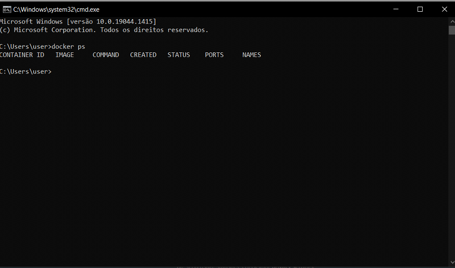

# Instalação do Docker no Windows

1. Digite os comandos abaixo em sequência
 
``` powershell
wsl --update 

dism.exe /online /enable-feature /featurename:Microsoft-Windows-Subsystem-Linux /all /norestart 

dism.exe /online /enable-feature /featurename:VirtualMachinePlatform /all /norestart 

wsl --set-default-version 2 
```

2. Habilite o Hyper-v e reincie o computador


3. Faça [download](https://www.docker.com/get-started) Docker Desktop

4. Após a instalação digete o comando

``` shell
$ docker ps
```



5. Caso tenha acontecido alguma falha tente desabilitar "Use the WSL 2 based engine"
    


  
